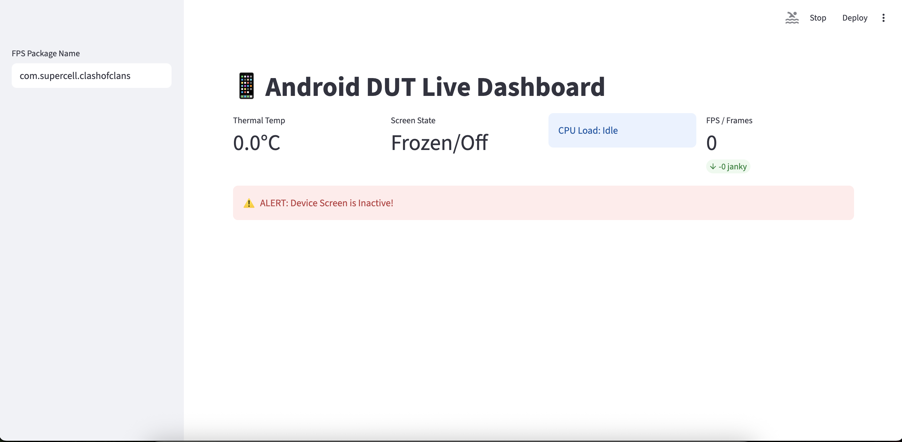

# 🎮 Android Game Profiler (ADB + Streamlit + MCP)

A **real-time Android performance monitoring dashboard** built using **Streamlit**, powered by **ADB (Android Debug Bridge)**, and enhanced with an **MCP-style AI tool router**.

This tool helps you monitor **game/app performance** including FPS, CPU, memory, thermals, and battery — with both **live tracking**, **session recording**, and an **AI chat interface**.



---

## 🚀 Features

### 📡 Real-Time Monitor

* Live device metrics:

  * 🔋 Battery % & temperature
  * ⚡ CPU usage
  * 💾 Memory (PSS/RSS)
  * 🎞️ FPS estimation
  * 🔥 Thermal stats
* Auto-refresh dashboard with rolling charts
* Jank detection (frame drops)

---

### 🎬 Session Recorder

* Record performance for configurable duration (10–120 sec)
* Export results as CSV
* Summary insights:

  * Avg FPS, CPU, battery drain
  * Peak thermals & memory
* Interactive Plotly charts

---

### 🤖 AI Chat (MCP-style)

* Ask questions in **natural language**
* Smart routing to device tools
* Example:

  * “Check device health”
  * “How is FPS performance?”
  * “Give me full summary”

---

### 🔌 ADB Integration

* Uses `adb shell` commands to fetch:

  * `dumpsys battery`
  * `dumpsys meminfo`
  * `dumpsys cpuinfo`
  * `SurfaceFlinger` / `gfxinfo`
* Works with:

  * USB devices
  * Wireless ADB (recommended)

---

## 🧱 Tech Stack

* **Frontend/UI**: Streamlit
* **Data Processing**: Pandas
* **Visualization**: Plotly
* **Device Communication**: ADB
* **AI Tool Routing**: MCP-style architecture (`FastMCP`)
* **Language**: Python 3.11

---

## 📂 Project Structure

```
.
├── app.py                  # MCP tools & backend logic
├── dashboard_server.py     # Main Streamlit dashboard
├── requirements.txt
├── Dockerfile
├── docker-compose.yml
├── .gitignore
├── .dockerignore
```

---

## ⚙️ Setup (Local)

### 1. Install dependencies

```bash
pip install -r requirements.txt
```

### 2. Setup ADB

```bash
adb devices
```

Ensure your device is listed.

---

### 3. Run Streamlit app

```bash
streamlit run dashboard_server.py
```

Open:

```
http://localhost:8501
```

---


## 🧪 Example Use Cases

* 🎮 Mobile game performance testing
* 📱 Device thermal profiling
* 🧪 QA automation insights
* 📊 Performance benchmarking
* 🤖 AI-assisted debugging

---

## 📊 Metrics Collected

| Metric   | Source                     |
| -------- | -------------------------- |
| Battery  | `dumpsys battery`          |
| CPU      | `dumpsys cpuinfo`          |
| Memory   | `dumpsys meminfo`          |
| FPS      | `SurfaceFlinger / gfxinfo` |
| Thermals | `/sys/class/thermal`       |

---
